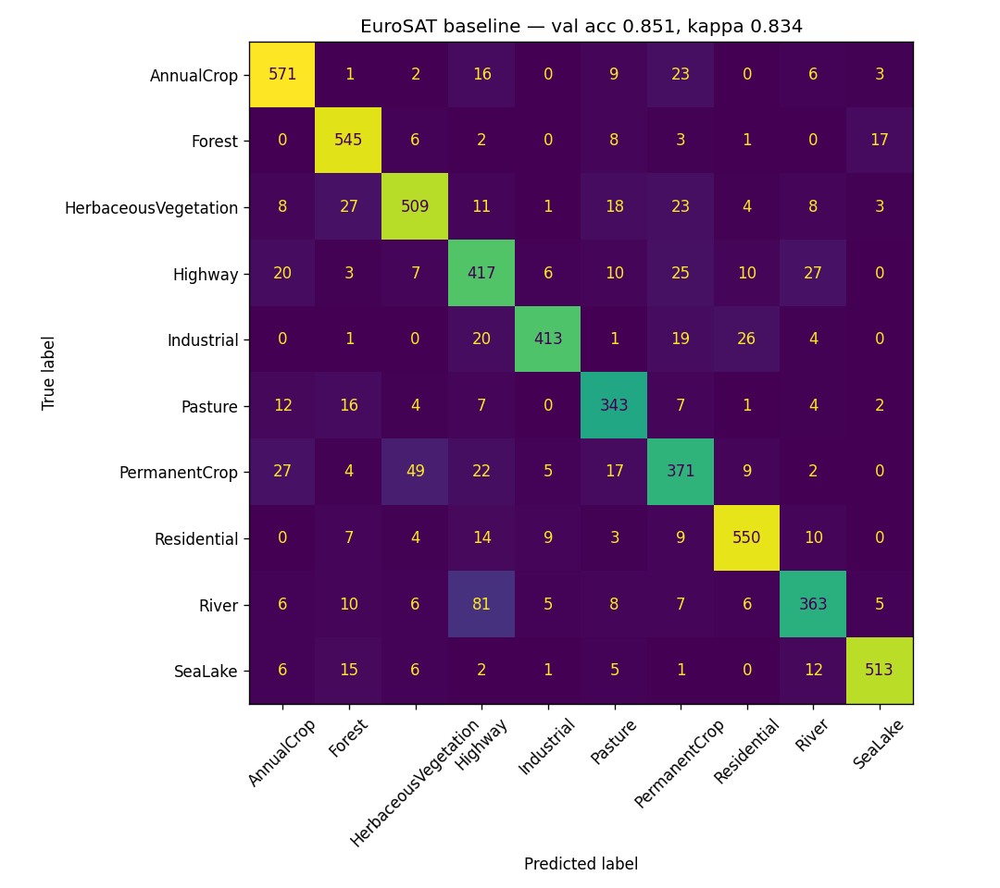

# Land-Cover Classification from Sentinel-2 Satellite Imagery

Classifying 27,000 EuroSAT satellite patches into 10 land-cover classes (Forest, River, Industrial, cropland types, ...) with **spatially honest evaluation** — measuring how much a standard random train/val split overstates performance versus spatial cross-validation.

## Results (Phase A baseline — updated as phases complete)

| Model | Split | Accuracy | Cohen's kappa |
|---|---|---|---|
| ResNet18 frozen backbone (3 epochs, CPU) | random 80/20 | 85.2% | 0.835 |
| ResNet18 frozen backbone (identical training) | **spatial 50km blocks** | 85.6% | 0.838 |
| ResNet18 **full fine-tune** (discriminative LRs, 3 epochs, CPU) | random 80/20 | **96.4%** | 0.960 |
| ResNet18 full fine-tune (identical training) | **spatial 50km blocks** | **95.8%** | 0.953 |

Top confusions: River→Highway (81) — both linear features; PermanentCrop→HerbaceousVegetation (49) — similar vegetation texture at 10 m resolution.

**Phase C finding (capacity experiment):** full fine-tuning lifted accuracy **+11 points** (85.2% → 96.4%) — and the random-vs-spatial gap moved from **−0.4% (frozen) to +0.7% (fine-tuned)**: a small leakage signal appeared exactly when memorization capacity was added, directionally consistent with the capacity hypothesis, though modest (below 1 point) at 50 km blocks. The honest headline number for new geography is **95.8%**.

**Phase B finding (honest null result):** patch coordinates were recovered from EuroSAT's multispectral GeoTIFF metadata (tiepoint/scale/EPSG tags, parsed with `tifffile`), and whole 50 km blocks were held out so no neighbouring patch could leak across the split. The spatial score *matched* the random score (−0.4%, within noise): **no measurable spatial leakage in the frozen-backbone configuration** — consistent with the 5,130-parameter trainable head having little capacity to memorize places. Phase C tests whether full fine-tuning (11M parameters) reopens the gap. Caveat: single holdout per condition (CPU budget), not full GroupKFold.



## Why this project
Land-cover classification is the foundational task of Earth observation. This repo demonstrates:
- **Vision-model fluency** — CNN transfer learning, later CNN-vs-transformer benchmarking
- **Rigorous geospatial validation** — Cohen's kappa, per-class IoU, and spatial CV to eliminate spatial-autocorrelation leakage
- **Reproducibility** — seeded splits, pinned requirements, metrics-first reporting

## Quickstart
```bash
python3 -m venv .venv && source .venv/bin/activate
pip install -r requirements.txt
python src/explore_data.py   # downloads EuroSAT (~90 MB), prints class stats
python src/train.py --epochs 3
```

## Roadmap
- [x] Phase A — ResNet18 baseline on EuroSAT, accuracy + kappa + confusion matrix
- [x] Phase B — spatial cross-validation; gap measured: none (frozen backbone) — see finding above
- [ ] Phase C — full Sentinel-2 tiles; CNN vs transformer; per-class IoU
- [ ] Phase D — write-up framed around the spatial-CV finding

## AI Tutor (visual guide chatbot)
```bash
.venv/bin/python src/tutor_server.py
# then open http://localhost:8787/visual_guide.html
```
Ask questions in the sidebar (reference sections as "Image 1"…"Image 6"); answers arrive as animated visual explanations. New concepts become persistent tabs. Uses the local PAI Inference tool (Claude subscription — no API key); falls back to an offline knowledge base of 8 animated explainers.

## Repo guide
- `src/explore_data.py` — dataset download + class distribution + sample grid
- `src/train.py` — transfer-learning baseline (heavily commented for learning)
- `docs/LEARNING.md` — layered beginner-to-interview explanation of every concept used
- `docs/INTERVIEW_QA.md` — 30 interview questions with model answers

Data: [EuroSAT](https://github.com/phelber/EuroSAT) (Sentinel-2, CC-BY-4.0). Free data, free compute — trains on a laptop CPU in minutes.
